# Ссылки на google colab ноутбуки
https://colab.research.google.com/drive/1WMyYcl4d81UOiqpbwYW3D7x32wr1odDa?usp=sharing
https://colab.research.google.com/drive/1soMUaWSFnSSqHvgBRMXS4ArzETDoZIQd?usp=sharing

# Скриншоты и статистика из файлов FastQC или multiQC
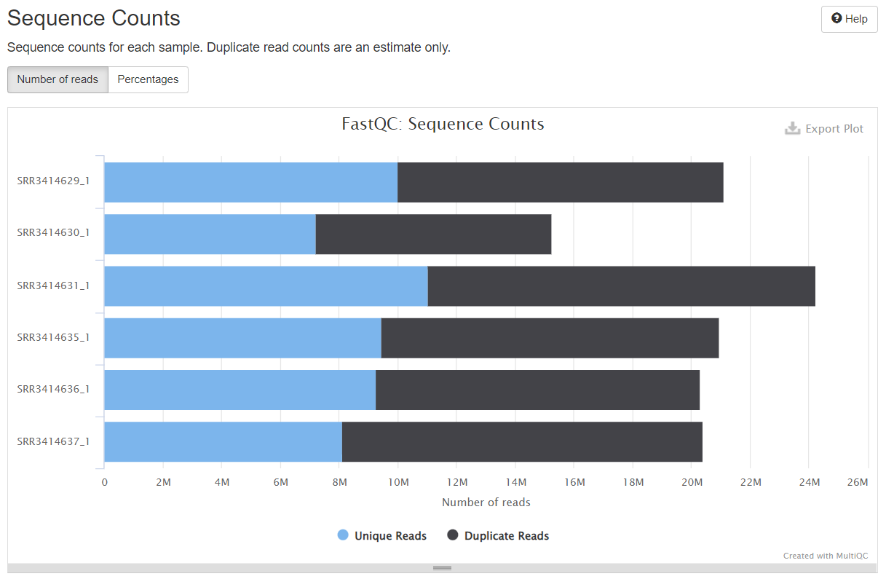
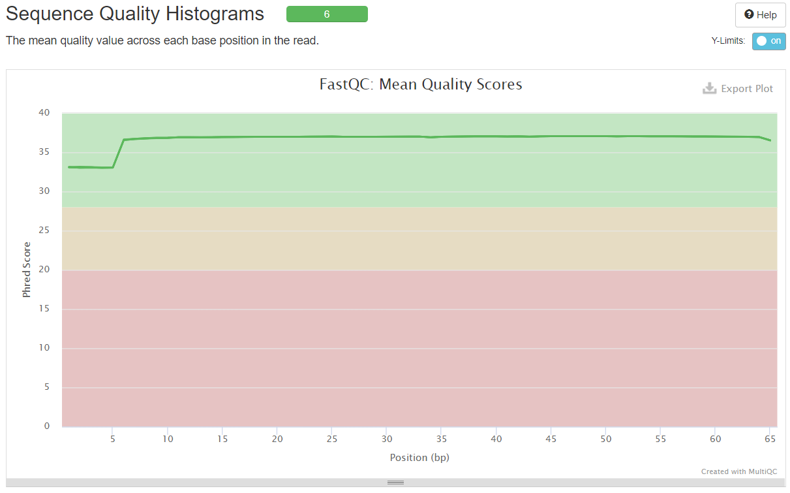
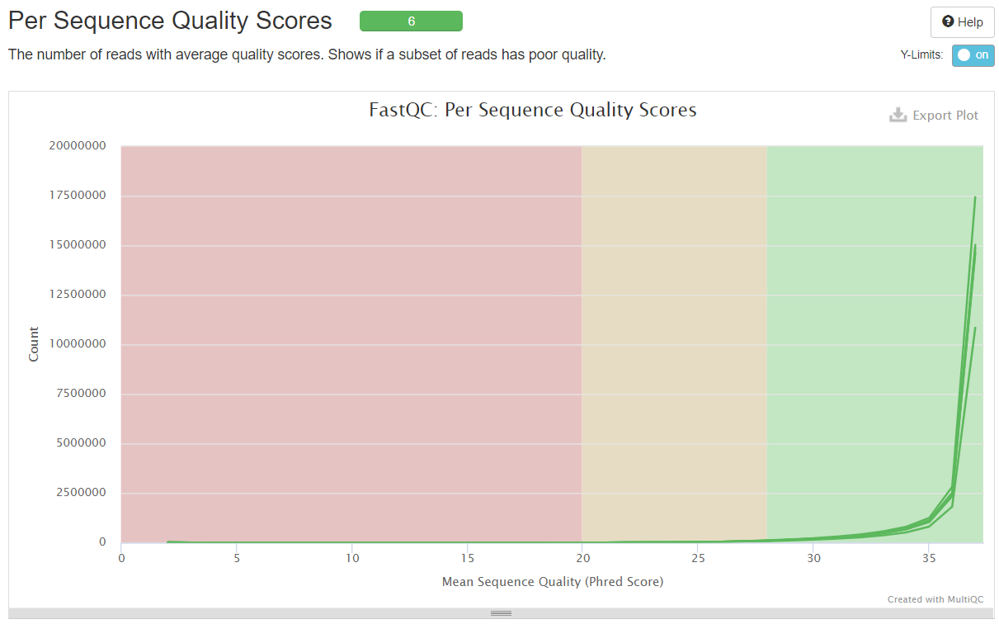
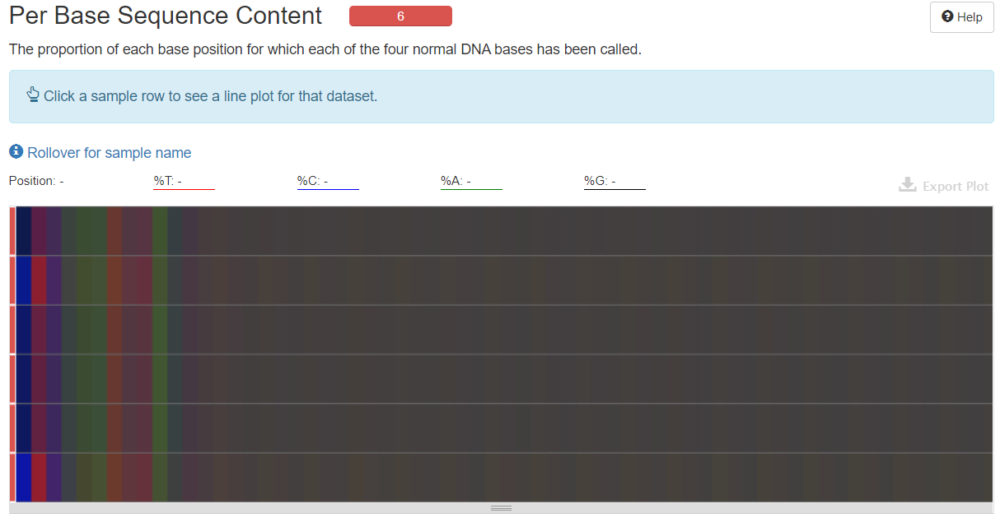
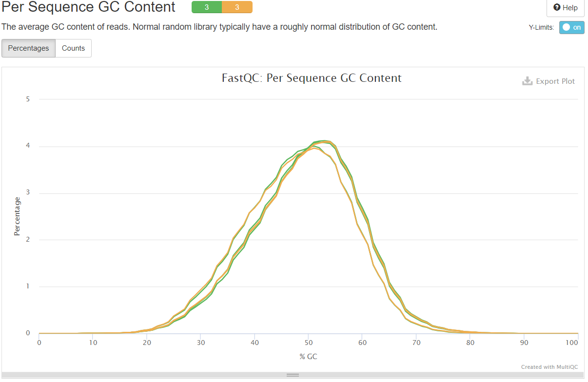
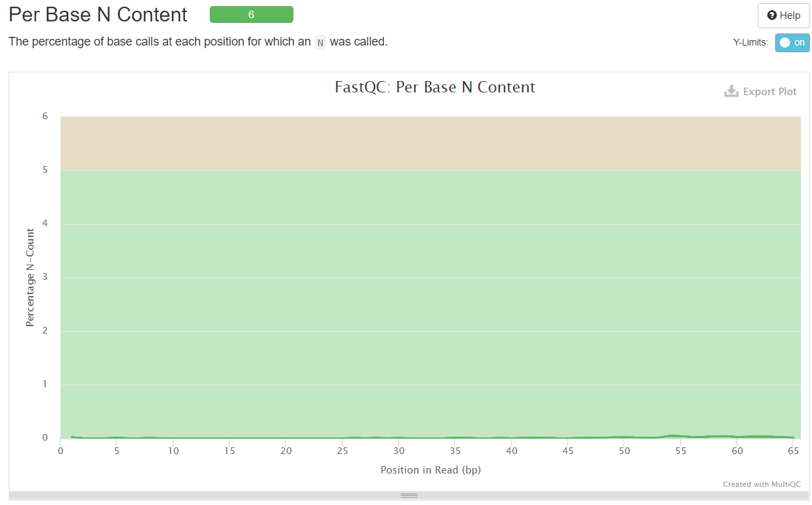
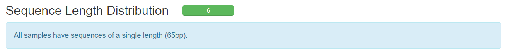
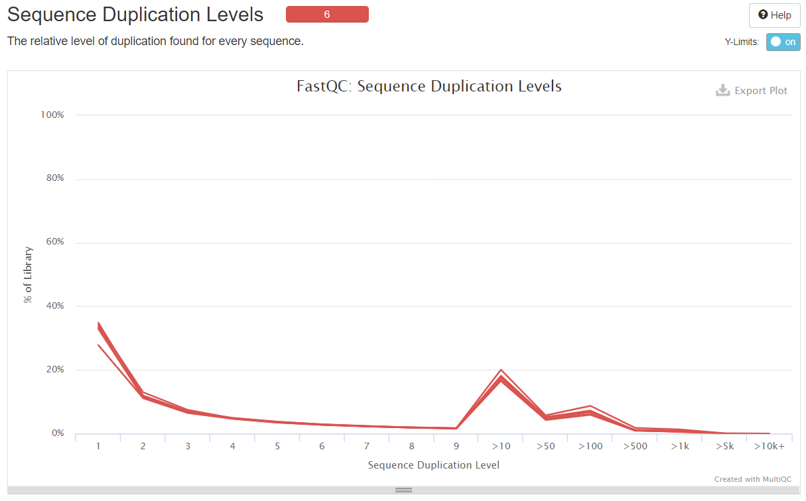
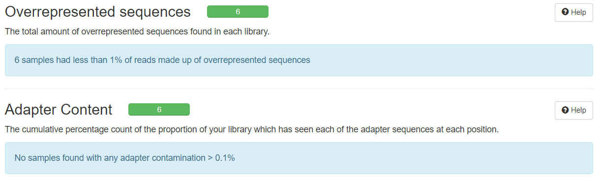

# Таблица со статистикой по каждому из 6-ти образцов
| ID образца | Тип образца | Общее кол-во исходных чтений | Успешно откартированы на геном | Уникально откартированные чтения | Общее кол-во чтений, которые попали на гены |
|---|---|---|---|---|---|
| SRR3414629 | reprogramming | 21106089 | 20510113 (97.2%) | 18375888 (87.1%) | 16049609 |
| SRR3414630 | reprogramming | 15244711 | 14832680 (97.3%) | 13186139 (86.5%) | 11465324 |
| SRR3414631 | reprogramming | 24244069 | 23547686 (97.1%) | 20928945 (86.3%) | 18408851 |
| SRR3414635 | control | 20956475 | 20395865 (97.3%) | 18428317 (87.9%) | 16275997 |
| SRR3414636 | control | 20307147 | 19757059 (97.3%) | 17825380 (87.8%) | 15757580 |
| SRR3414637 | control | 20385570 | 19847291 (97.4%) | 17844858 (87.5%) | 15736978 |

# Графики из анализа DESeq2
## MA-plot
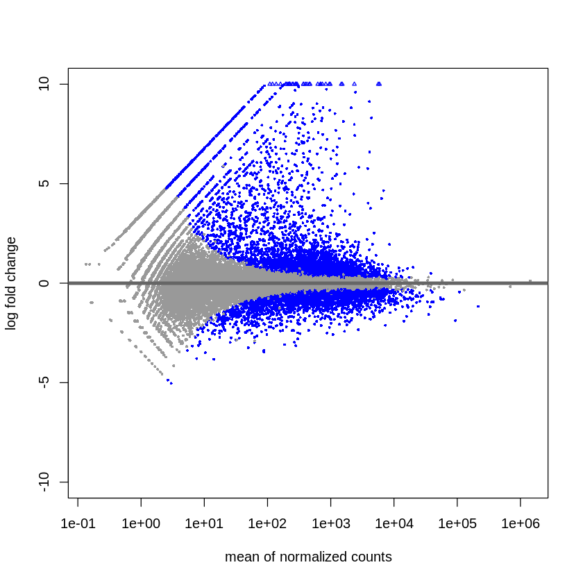
## Тепловая карта, которая показывает, что все контрольные образцы похожи между собой, а перепрограммированные образцы -- между собой
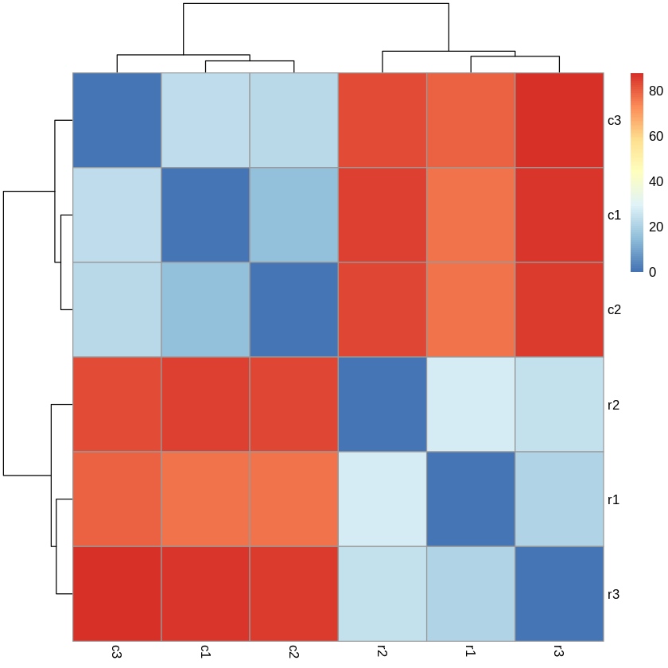
## Графики со значениями "Normalized counts" в контрольных и перепрограммированных образцах
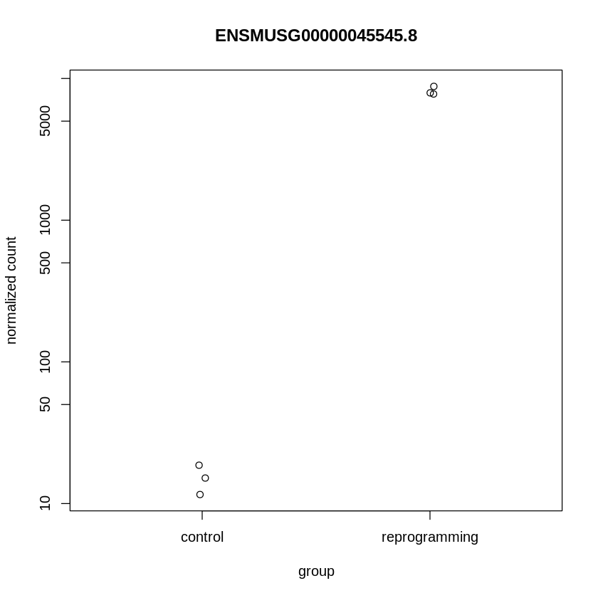
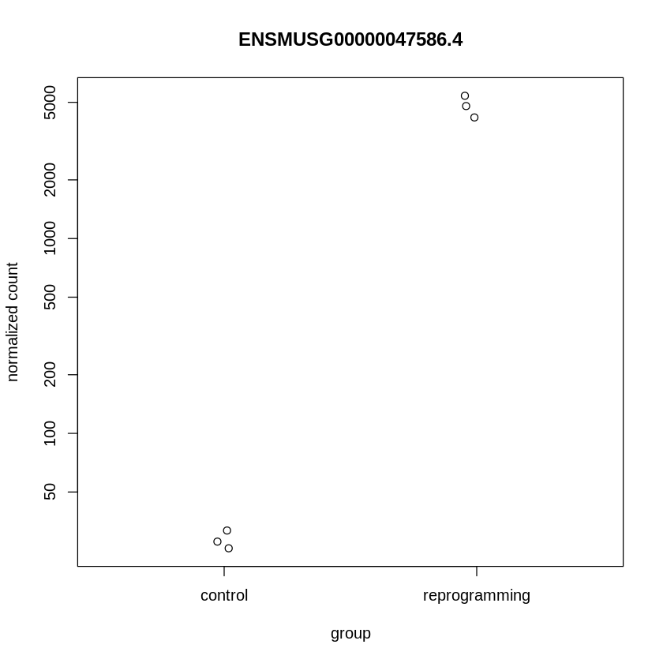
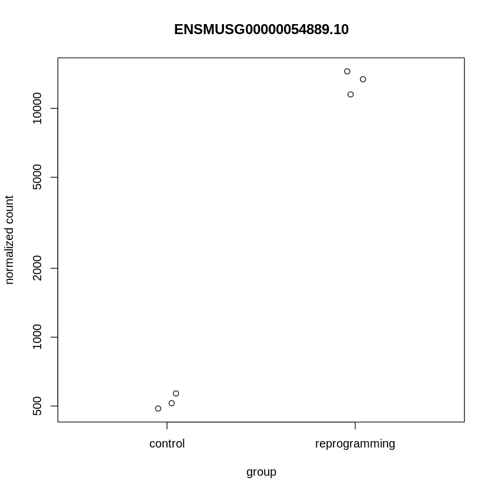